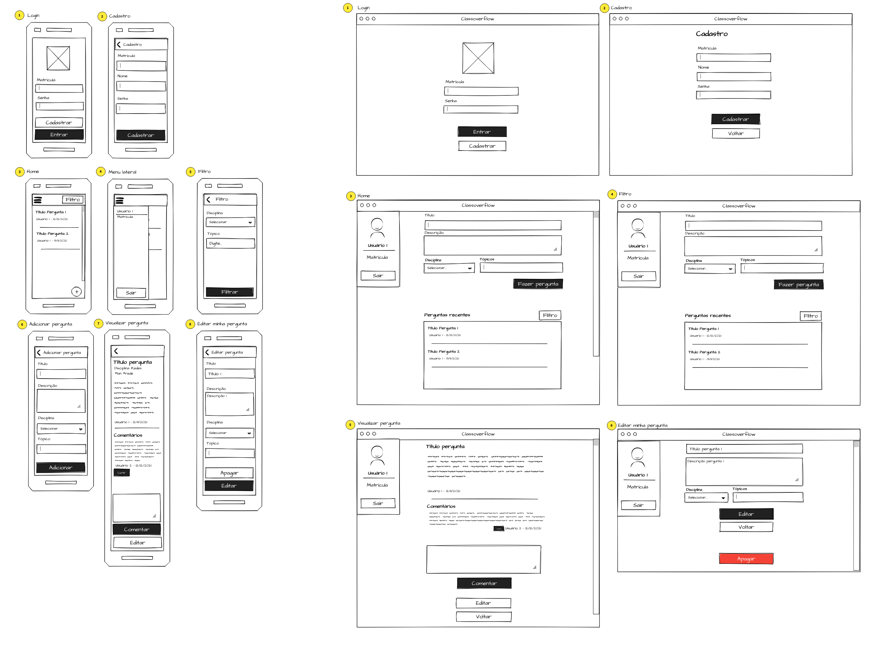
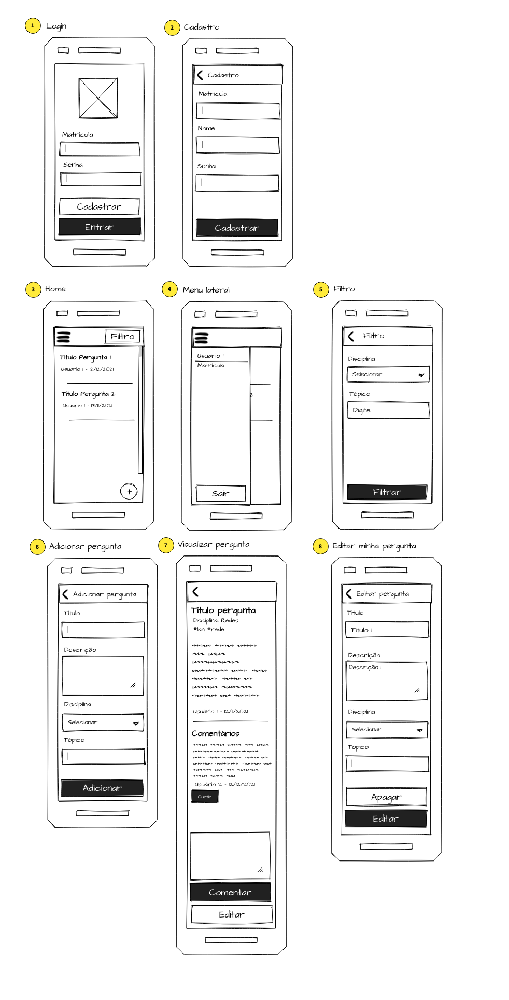
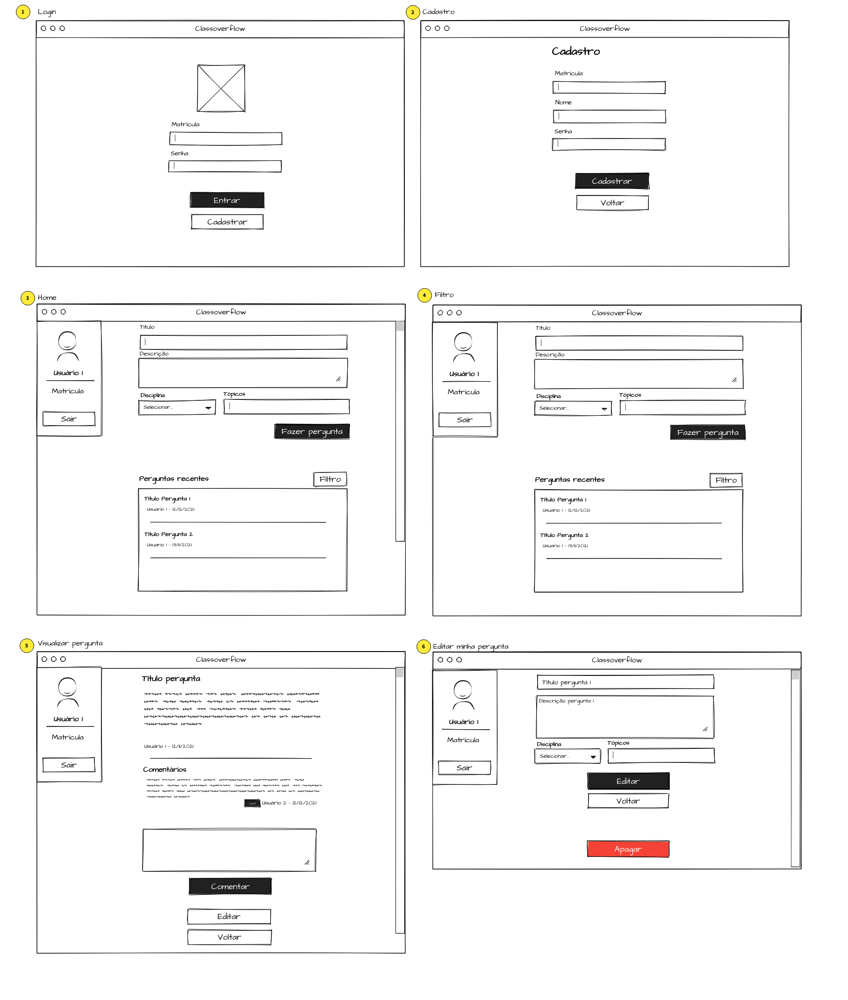

# Projeto de Interface

## Protótipo geral

## Mobile

1. Tela de login. Nela o usuário tem a opção de acessar a tela de cadastro de um novo usuário
2. Tela de cadastro de um novo usuário.
3. Tela principal do aplicativo, no qual mostra a listagem de perguntas recentes. Nela o usuário também tem a opção de acessar a tela de adição de pergunta.
4. Menu lateral para visualizar as informações do usuário e efetuar o logout da aplicação.
5. Tela de adição de uma nova pergunta
6. Tela de visualização de uma pergunta. Nela o usuário também poderá adicionar comentários ao tópico ou então editar sua pergunta.
7. Tela de edição de pergunta para que o usuário possa editar suas perguntas feitas.

### User Flow Mobile

- A primeira tela do usuário é a Tela de Login (1).
- A partir da Tela de Login (1) o usário pode efetuar o login e acessar o aplicativo (3) ou então o cadastro (2).
- A partir da Tela de Cadastro (2) o usuário poderá voltar para a tela de login (1).
- A partir da Tela principal (3) o usuário poderá acessar suas informações contidas no menu lateral ou sair do aplicativo (4).
- A partir da Tela principal (3) o usuário poderá acessar a tela de adição de um nova pergunta (5).
- A partir da Tela principal (3) o usuário poderá acessar a tela de visualização de pergunta (6).
- A partir da Tela de visualização de pergunta (6) o usuário poderá acessar a tela de edição de pergunta (7) caso seja de sua autoria.

## WEB

1. Tela de login. Nela o usuário tem a opção de acessar a tela de cadastro de um novo usuário
2. Tela de cadastro de um novo usuário.
3. Tela principal do aplicativo, no qual mostra a listagem de perguntas recentes. Nela o usuário também tem a opção de adicionar uma nova pergunta.
4. Tela de visualização de uma pergunta. Nela o usuário também poderá adicionar comentários ao tópico ou então editar sua pergunta.
5. Tela de edição de pergunta para que o usuário possa editar suas perguntas feitas.

### User Flow WEB

- A primeira tela do usuário é a Tela de Login (1).
- A partir da Tela de Login (1) o usário pode efetuar o login e acessar o aplicativo (3) ou então o cadastro (2).
- A partir da Tela de Cadastro (2) o usuário poderá voltar para a tela de login (1).
- A partir da Tela principal (3) o usuário poderá acessar a tela de visualização de pergunta (4).
- A partir da Tela de visualização de pergunta (4) o usuário poderá acessar a tela de edição de pergunta (5) caso seja de sua autoria.
