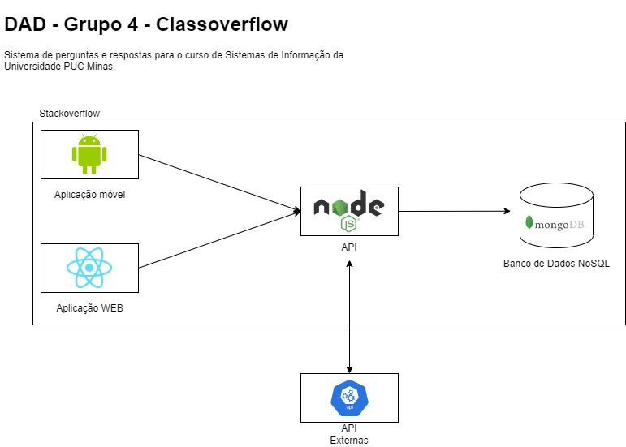

# Arquitetura da Solução

Nesta seção é apresentado o modelo arquitetural e especificações técnicas definidas para o sistema de aplicações.

## Diagrama de componentes

A figura abaixo representa visualmente a arquitetura definida para a aplicação.

Figura 1 - Arquitetura da Solução

 

A solução implementada conta com os seguintes módulos:

- **Aplicação WEB**: Aplicação WEB em React Native referente ao projeto do Classoverflow
- **Aplicação móvel**: Aplicação móvel em Android Nativo referente ao projeto do Classoverflow
- **API**: API interna em Node.JS para consumo das aplicações WEB e Mobile.
- **Banco de Dados**: Banco de dados NoSQL, Mongo.DB utilizado para armazenamento e consulta de informações referente ao projeto Classoverflow
- **API Externas**: APIs externas para realizar integrações com outros sistemas.

## Tecnologias Utilizadas

### Aplicação WEB

Para o desenvolvimento do módulo WEB utilizamos o framework WEB React. Tal tecnologia foi escolhida devido a sua curva de aprendizado rápida e faclidade de criar e reutilizar layouts/componentes. Para desenvolver, está sendo utilizado a IDE Visual Studio Code.

### Aplicação móvel

Para o desenvolvimento do módulo móvel utilizamos a tecnologia Android Nativo. Tal tecnologia foi escolhida devido sua melhor performance e pelo conhecimento prévio de alguns integrantes do time. Para desenvolver, está sendo utilizado a IDE Android Studio.

### API

Para o desenvolvimento do módulo da API utilizamos a tecnologia Node.JS. Tal tecnologia foi escolhida devido sua facilidade em desenvolver com poucas linhas de código e sua performance. Além do mais, ela também foi escolhida devido a um conhecimento prévio de alguns integrantes do time. Para desenvolver, está sendo utilizado a IDE Visual Studio Code.

### Banco de Dados

Para o armazemento e consulta de dados foi escolhido a tecnologia Mongo.db devido a sua grande performance para lidar com grande quantidade de dados e sua velocidade na busca dos mesmo. Por estarmos criando um sistema de parecido com stackoverflow estamos ciente que o número de dados será alto. Além do mais, o Mongo.db possui uma ótima interface de comunicação com o Node.JS.

### Demais ferramentas

Para gerenciamento do código fonte e da documentação estamos utilizando o Git, juntamente com a plaforma Github. Para documentação da arquitetura está sendo utilizado a ferramenta Draw.io. Por fim, para a criação dos protótipos esta sendo utilizado a ferramenta Wireframe.
