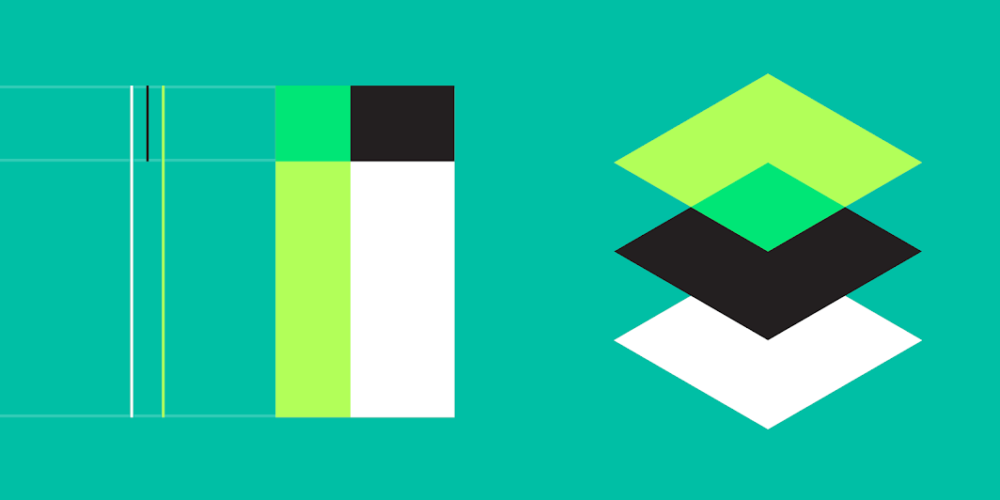

# Template padrão do site

Layout padrão do site que será utilizado em todas as páginas com a definição de identidade visual, aspectos de responsividade e iconografia será baseado no design criado pela Google, o [Material Design](https://material.io/design).

O Material Design possui uma excelente comunicação e harmonia para desenvolvimento de aplicações móveis, principalmente para Android Nativo. Para o desenvolvimento WEB, será utilizada a biblioteca [Material UI](https://mui.com/). Tal biblioteca foi desenvolvida com o objetivo de trazer os elementos do Material Design para o desenvolvimento React.

